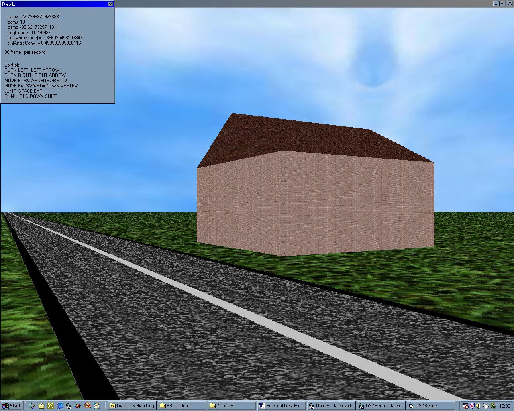



## Direct3D 8 World Example

### Description

Thanks for downloading my code. This is really just an example of how to begin a world in Direct3D 8. The graphics aren't very good, but I hope that it maybe helps someone. It's pretty well commented and I think it's quite easy to understand. If you have any questions/queries, I'll endeavour to answer them. Please provide feedback and please vote.

I wasn't going to post this yet, but I need some help to finish/make it better. I am stuck on how to do collision detection and also how to make colours in a texture transparent. If anyone can help with either of these problems, I'd be very grateful. You can either provide your response in the form of feedback, or drop me a line at r_hayden@breathemail.net.

Hopefully, then I can release a complete D3D 8 world.

Thanks for your time.

Special thanks must go to Simon Price (http://www.vbgames.co.uk) for his excellent D3D tutorials and the help which he gave me on some of this project.
 
### More Info
 

             |
---                |---
**Submitted On**   |2000-12-12 20:32:14
**By**             |[Rich Hayden](https://github.com/Planet-Source-Code/PSCIndex/blob/master/ByAuthor/rich-hayden.md)
**Level**          |Intermediate
**User Rating**    |5.0 (40 globes from 8 users)
**Compatibility**  |VB 6\.0
**Category**       |[DirectX](https://github.com/Planet-Source-Code/PSCIndex/blob/master/ByCategory/directx__1-44.md)
**World**          |[Visual Basic](https://github.com/Planet-Source-Code/PSCIndex/blob/master/ByWorld/visual-basic.md)
**Archive File**   |[CODE\_UPLOAD1262312122000\.zip](https://github.com/Planet-Source-Code/rich-hayden-direct3d-8-world-example__1-13511/archive/master.zip)

### API Declarations

See Code.

